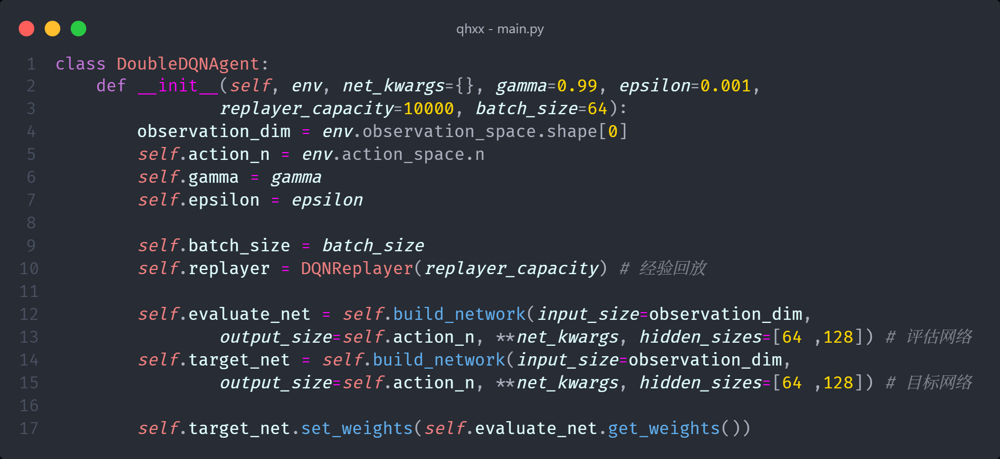

<!--
 * @Author: jonnyzhang02 71881972+jonnyzhang02@users.noreply.github.com
 * @Date: 2023-06-20 20:51:25
 * @LastEditors: jonnyzhang02 71881972+jonnyzhang02@users.noreply.github.com
 * @LastEditTime: 2023-06-25 01:26:09
 * @FilePath: /qhxx/README.md
 * @Description: coded by ZhangYang@BUPT, my email is zhangynag0207@bupt.edu.cn
-->

# 强化学习大作业

[TOC]

## `MountainCar-v0`离散版本

### 1. 环境

本次使用的环境是openai的[MountainCar-v0](https://gymnasium.farama.org/environments/classic_control/mountain_car/)

Mountain Car MDP是一个确定性的马尔科夫决策过程（MDP），它由一辆汽车被随机放置于一个正弦山谷的底部组成，汽车唯一可能的动作是向前或向后加速。MDP的目标是通过策略性地加速汽车，使其到达位于右山顶的目标状态。在gymnasium中有两个版本的Mountain Car领域：一个是使用离散动作的版本，另一个是使用连续动作的版本。这个版本是使用离散动作的版本。

该API包含四个关键函数： make 、 reset 、 step 和 render。

Gymnasium的核心是 Env ，它是一个高水平的python类，代表强化学习理论中的马尔科夫决策过程（这不是一个完美的重构，缺少MDP的几个组成部分）。

在gymnasium中，环境（MDPs）与 Env 一起被实现， Wrappers 可以改变传递给用户的结果。

下图的经典 "代理-环境循环 "是Gymnasium实现的强化学习的简化表示。

下面展示了环境的详细参数：

### 2. 算法

#### 2.1 DQN

深度Q网络（Deep Q-Network，DQN）是强化学习中的一种算法，它结合了深度神经网络和Q学习。

Q-learning是一个值迭代算法，用于估计一个动作-价值函数，即Q函数。而深度神经网络用于对这个Q函数进行函数逼近，以便在复杂、高维度的状态空间中进行泛化。

DQN的主要步骤是：

1. **初始化网络**：初始化一个深度神经网络用于Q值的估计。这个网络接收环境的状态作为输入，输出各个可能动作的预期回报。

2. **经验回放**：创建一个经验回放缓冲区用于存储各个时刻的状态、动作、奖励和下一个状态。在每个时间步，先执行一个动作并将得到的经验存储在经验回放缓冲区，然后从经验回放缓冲区随机取样一些经验用于训练。

3. **计算目标Q值**：使用奖励和下一个状态的最大Q值（由另一个目标网络估计）计算目标Q值。

4. **优化网络**：使用目标Q值和网络预测的Q值之间的差（即TD误差）来优化网络的参数。

5. **同步网络**：定期用估计网络的参数来更新目标网络。

DQN的主要优点是可以处理高维度、连续的状态空间，并且可以通过经验回放技术解决强化学习中的样本相关性问题和非稳态分布问题。然而，DQN也有其局限性，例如它不能直接处理连续的动作空间，对超参数选择敏感，以及可能会遇到过度估计的问题等。

#### 2.2 `Double DQN`

`Double DQN`是对深度Q网络（DQN）的一个改进，其出发点是解决DQN的一个主要问题，即对优化行动价值（Q值）的过度估计。这个过度估计的问题源于DQN在更新Q值时，既使用相同的网络来选择行动，也用来计算该行动的Q值。

`Double DQN`的工作方式与DQN类似，但在更新Q值时，它将行动选择和Q值计算分离。具体来说，`Double DQN`使用一个网络（在线网络）来选择最佳行动，然后使用另一个网络（目标网络）来计算被选择行动的Q值。

`Double DQN`的优势是减少了过度估计的问题，从而使得学习过程更稳定，并且在许多任务中能够提高性能。这是因为过度估计可能导致过度优化某些行动，从而忽视其他可能更优的行动。通过引入`Double DQN`，我们可以更准确地估计行动的真实价值，从而做出更好的决策。

总的来说，使用`Double DQN`是因为它提供了更准确的Q值估计，使得学习过程更稳定，并且在许多任务中能够提高性能。

本次任务中使用 `Double DQN` 。

#### 2.3 网络结构

基于输入层、输出层和这两个隐藏层，`evaluate_net`和`target_net`的完整结构如下：

1. **输入层**：输入层的节点数等同于环境状态的维度，即2，一个是位置，一个是速度。

2. **隐藏层**：隐藏层用于处理输入信息，并提取有用的特征。在这个模型中，有两个隐藏层。第一个隐藏层有64个神经元，第二个隐藏层有128个神经元。这两个隐藏层都使用ReLU激活函数。

3. **输出层**：输出层的节点数等同于可能的行动数量，即3，分别是向左、向右和不动。

在训练过程中，输入层接收环境状态作为输入，通过隐藏层进行处理和特征提取，然后在输出层输出对应每个可能行动的预测Q值。神经网络的参数（权重和偏置）会根据反向传播算法和优化器（这里使用的是Adam优化器）进行调整，以减小预测Q值和目标Q值之间的差距。

### 3. 代码

#### 3.1 代码结构

#### 3.2 经验回放`DQNReplayer`

`DQNReplayer`类是用于实现经验回放（Experience Replay）机制的。

经验回放是DQN的关键组件之一，主要目的是打破数据之间的相关性和减少训练样本的浪费，通过存储智能体的经验并从中随机抽样进行学习。

下面是类的每个部分的详细解释：

- `__init__(self, capacity)`: 这是类的初始化函数。`capacity`参数决定了经验回放池的大小。经验回放池是一个DataFrame，有5个列：'observation'，'action'，'reward'，'next_observation'和'done'，用于存储每一步的经验。`self.i`是一个指针，指向当前要插入新经验的位置。`self.count`记录了目前存储的经验的数量。

- `store(self, *args)`: 这个方法用于将一次智能体的经验存储在经验回放池中。`*args`包括'observation'，'action'，'reward'，'next_observation'和'done'这五个元素。每次存储经验后，指针`self.i`就会向前移动一个位置，如果到达池子的容量上限，就会回到起点（这是通过`% self.capacity`实现的，这也就是为什么叫它经验回放“池”，因为它是一个循环的）。同时，`self.count`会增加1，直到达到`self.capacity`。

- `sample(self, size)`: 这个方法用于从经验回放池中随机抽取一些经验进行学习。参数`size`决定了抽取的数量。这个方法首先从当前存储的所有经验中随机抽取`size`个索引，然后返回这些索引对应的经验。这就是经验回放的主要操作，也是DQN中非常关键的一步。

整体来看，DQNReplayer类提供了经验存储和随机抽取的功能，它是实现经验回放机制的关键部分。

#### 3.3 智能体`DoubleDQNAgent`

##### 3.3.1 `__init__`方法

下面是对每个参数的解释：

- `env`：环境对象，用于获取观察的维度和动作的数量。
- `net_kwargs`：字典参数，包含了构建网络模型所需的关键参数。
- `gamma`：衰减因子，用于计算未来奖励的折扣值。
- `replayer_capacity`：经验回放的容量大小，即最多可以存储的经验数量。
- `batch_size`：每次更新模型时，从经验回放中抽取的批次大小。

在初始化函数中，主要进行了以下操作：

- `observation_dim`：从环境中获取观察的维度。
- `self.action_n`：从环境中获取可能的动作数量。
- `self.gamma` 和 `self.epsilon`：设置衰减因子和ε值。
- `self.batch_size`：设置每次训练的批次大小。
- `self.replayer`：创建一个经验回放对象，初始化其容量为`replayer_capacity`。
- `self.evaluate_net`：创建一个用于评估的神经网络，输入维度为观察的维度，输出维度为动作的数量，隐藏层大小为[64,128]。
- `self.target_net`：创建一个用于目标的神经网络，其结构和`self.evaluate_net`相同。该网络用于生成Q-Learning更新公式中的目标Q值。
- `self.target_net.set_weights(self.evaluate_net.get_weights())`：将评估网络的权重复制给目标网络。

这个初始化函数为智能体的训练和决策提供了必要的设置和工具。

##### 3.3.2 `build_network`方法

`build_network`方法是用来构建神经网络模型的，这里的网络模型是用来作为Double DQN算法中的Q函数的近似。

以下是该函数的参数以及每一步操作的解释：

参数解释：
- `input_size`：神经网络输入层的节点数，等同于环境状态的维度。
- `hidden_sizes`：一个列表，包含了每个隐藏层的节点数。
- `output_size`：神经网络输出层的节点数，等同于可能的行动数量。
- `activation`：隐藏层的激活函数，默认为ReLU函数。
- `output_activation`：输出层的激活函数，默认为None，表示输出层不使用激活函数。
- `learning_rate`：学习率，用于在优化器中调整模型参数的步长。

方法的步骤如下：

1. `model = keras.Sequential()`：初始化一个顺序模型对象。
2. 在隐藏层部分，函数遍历`hidden_sizes`列表，在模型中加入相应数量的全连接层（Dense）。每个全连接层的单元数为`hidden_sizes`中的一个元素，激活函数为`activation`。对于第一个隐藏层，需要提供`input_shape`参数，即输入的维度。
3. `model.add(keras.layers.Dense(units=output_size,activation=output_activation))`：在模型最后加入一个全连接层作为输出层，其单元数为`output_size`，激活函数为`output_activation`。
4. `optimizer = tf.optimizers.Adam(lr=learning_rate)`：定义优化器，这里使用的是Adam优化器，学习率为`learning_rate`。
5. `model.compile(loss='mse', optimizer=optimizer)`：编译模型，设置损失函数为均方误差（mse）和优化器为Adam。

最后，函数返回创建好的模型。

总的来说，`build_network`方法是用来创建一个多层感知器（MLP）模型的，这个模型将在后续的DQN训练中被用来估计Q值。

##### 3.3.3 `learn`方法

`learn` 方法在智能体进行学习的过程中起核心作用，主要执行以下步骤：

1. **存储经验**：当前观察（`observation`），行为（`action`），奖励（`reward`），下一个观察（`next_observation`），以及“是否结束”标志（`done`）被存储到经验回放存储器（`replayer`）中。

2. **采样经验**：从经验回放存储器中随机采样一批经验，每批大小为`batch_size`。

3. **计算目标Q值**：对于每个采样的经验，我们使用评估网络（`evaluate_net`）来预测下一个观察的Q值，然后选择具有最高Q值的行动（`next_actions`）。然后我们使用目标网络（`target_net`）来预测下一个观察的Q值，只选择我们在前一步中选择的行动对应的Q值（`next_max_qs`）。最后，我们计算目标Q值（`us`）为立即奖励加上折扣后的未来最大Q值，但是如果该经验对应的步骤是结束步骤，那么就没有未来的Q值，因此要乘以`(1. - dones)`。

4. **更新评估网络**：我们首先使用评估网络来预测每个采样经验的当前观察的所有可能行动的Q值，然后用我们刚刚计算出的目标Q值替换掉其中我们实际执行的行动的Q值，得到新的目标Q值向量（`targets`）。然后我们使用这些观察和目标Q值向量来进行一次评估网络的训练。

5. **同步目标网络**：如果该经验对应的步骤是结束步骤（即`done=True`），我们就把评估网络的权重复制到目标网络，使得目标网络保持最新。

##### 3.3.4 `decide`方法

`decide`方法是基于`ε-greedy`（epsilon-贪心）策略做出决策的方法。ε-greedy策略是在探索（exploration）和利用（exploitation）之间寻找平衡的一种策略。以下是这个函数的详细步骤：

1. **探索**：以ε的概率随机选择一个行动。这里的ε被设定为一个介于0和1之间的值（如0.1），`np.random.rand()`函数会生成一个从0到1的随机数，如果这个随机数小于ε，那么我们就随机选择一个行动。这可以帮助智能体在一开始的时候对环境有所了解，而不是过早地固化策略。

2. **利用**：以1-ε的概率选择当前知识中的最佳行动。`self.evaluate_net.predict(observation[np.newaxis])`会返回评估网络对每个可能行动的预测Q值，然后我们通过`np.argmax(qs)`选择Q值最大的行动作为最佳行动。

ε-greedy策略的目标是在探索和利用之间找到平衡，通过引入一定的随机性，让智能体有可能选择到不是当前最优但可能是长期最优的行动，从而有更大可能找到全局最优策略。

#### 3.4 `play_qlearning`函数

`play_qlearning`函数是执行一次Q-learning算法的过程。这里的一次过程指的是从环境的初始化状态开始，智能体不断地与环境互动，直到达到终止条件（terminated）或者被截断（truncated）。函数的执行流程如下：

1. **初始化**：首先初始化一个用来记录本次过程总奖励的变量`episode_reward`，并获取环境的初始观察值`observation`。

2. **循环互动**：然后进入一个无限循环，每次循环都代表智能体与环境的一次互动。

   - **渲染环境**：如果参数`render`为True，那么就渲染（显示）环境的当前状态。

   - **决策**：智能体根据当前的观察值`observation`做出决策，得到要执行的行动`action`。

   - **执行行动**：智能体执行行动`action`，环境返回新的观察值`next_observation`、行动的奖励`reward`，以及是否达到终止条件`terminated`或被截断`truncated`。

   - **累计奖励**：将本次行动的奖励`reward`累加到总奖励`episode_reward`中。

   - **学习**：如果参数`train`为True，那么就用这一次的经验（包括初始观察、行动、奖励、新的观察和是否结束）来让智能体进行学习。

   - **判断结束**：如果达到终止条件或被截断，那么就结束这次过程，并跳出循环。

   - **更新观察**：将新的观察值`next_observation`更新为当前观察值`observation`，为下一次循环做准备。

3. **返回总奖励**：函数返回本次过程的总奖励`episode_reward`。

#### 3.5 主循环

##### 3.5.1 训练模型

训练阶段的目的是训练一个深度Q网络（Double DQN）智能体，使其能够学习如何最优地在MountainCar-v0环境中行动。

下面是训练过程的详细步骤：

1. 首先，环境被初始化，这里是MountainCar-v0环境，然后一个`DoubleDQNAgent`智能体被创建。

2. 然后开始最多1000次的训练周期（也就是最多1000个`episodes`）。每个周期都会通过`play_qlearning`函数与环境进行一次互动过程。

3. 在`play_qlearning`函数中，每个周期开始时，环境会被重置。然后智能体会在环境中执行动作，直到环境终止（也就是达到环境的终止条件，例如到达目标位置或最大步数）或者在某一步被截断。

4. 在每个周期中，智能体会根据当前观察到的环境状态，选择一个动作。这个动作的选择有两种可能：一是随机选择（以ε的概率），二是根据当前的策略网络选择最优动作。

5. 当智能体选择动作并执行后，环境会返回新的状态、奖励以及是否终止的信息。然后智能体会将这个经验（包括旧的状态、动作、奖励、新的状态和是否终止）存储到经验回放缓冲区。

6. 然后，智能体从经验回放缓冲区中随机取出一批经验，然后用这些经验来更新自己的策略网络（通过梯度下降来最小化预测的Q值和目标Q值之间的差距）。这个步骤会反复进行，直到环境终止或被截断。

7. 在每个周期结束后，会打印出当前周期的总奖励。

8. 如果当前周期的总奖励大于-200，智能体会保存当前的模型。

这个过程一直持续，直到到达满意的训练效果。

##### 3.5.2 测试模型

在推理阶段，智能体将根据训练阶段学习到的策略，与环境进行交互并尝试达成任务。

以下是推理阶段的详细步骤：

1. 训练好的模型被加载到智能体中。这个模型是在训练阶段保存的，包含了训练得到的权重。

2. 然后初始化两个列表`positions`和`velocities`，用于保存每一步的位置和速度信息，以便之后进行可视化。

3. 接着重置环境，即将环境初始化到初始状态。

4. 接下来开始与环境交互的循环。在每一步中，智能体都会根据当前环境的状态选择一个动作。这个选择是根据训练好的模型进行的，不再涉及随机选择。

5. 执行智能体选择的动作后，环境会返回新的状态、奖励、是否终止的信息。这一步中智能体不会进行学习，即不再更新网络的权重。

6. 将每一步的位置和速度信息添加到`positions`和`velocities`列表中。

7. 持续以上步骤，直到环境返回的`terminated`或`truncated`为True，即环境达到终止条件或者在某一步被截断。

8. 然后根据最后一步的位置信息判断智能体是否成功到达目标位置，打印出相应的信息。

9. 最后，使用matplotlib库绘制出智能体在每一步的位置和速度变化，进行可视化展示。

以上就是推理阶段的过程，这个过程主要是用来验证和展示智能体在训练阶段学习到的策略的效果，看是否能成功解决任务。

### 4. 效果展示

下图是选用的是第99个周期模型的测试结果，可以看到，小车能够先向左加速再向右加速，最终到达右侧山顶，这说明智能体已经学会了如何在MountainCar-v0环境中行动。

## 连续版本

**对于具有连续动作空间的问题，传统的Q学习和DQN不再适用，因为它们依赖于对每个可能的动作评估一个Q值。当动作是无限多个时，这就不再可能了。**

不过，有一些已经被提出的解决方法可以处理连续动作空间的问题：

1. **动作离散化**：尽管这种方法对于一些问题可能会导致精度损失，但在许多情况下，它仍然可以给出令人满意的结果。方法是将连续的动作空间离散化为有限数量的动作，然后使用这些离散动作来应用DQN或Q学习。

2. **策略梯度方法**：这是一类直接在策略空间中进行优化的方法，例如REINFORCE算法、`Actor`-`Critic`方法等。这类方法可以在连续动作空间中工作，因为它们不需要为每个可能的动作评估一个Q值。

3. **确定性策略梯度方法**：如深度确定性策略梯度（DDPG）算法和连续深度Q学习（CDQN）。这些方法结合了策略梯度和Q学习的思想，旨在解决连续动作空间的问题。DDPG等方法将动作选择问题转化为一个参数化函数的优化问题，这个函数会直接输出最优的动作。

4. **正态分布参数化**：有些策略使用神经网络来表示一个正态分布的参数（均值和方差），然后从这个分布中采样动作，这是连续控制问题中常见的一种做法，比如在使用Proximal Policy Optimization (PPO)算法时。

这些都是处理连续动作空间问题的常见方法，选择哪种方法需要根据具体任务和问题属性进行判断。

### 1. 环境

在连续版本的MountainCar-v0环境中，智能体的目标是让小车到达右侧山顶。与离散版本不同的是，这里的动作空间是连续的，智能体可以选择一个在[-1, 1]范围内的实数作为动作，这个实数表示小车的加速度。

### 2. 算法

#### 2.1 `Actor`-`Critic`网络

`Actor`-`Critic`是一种强化学习算法，它是策略梯度方法和值迭代方法的结合体。其名称中的"`Actor`"和"`Critic`"分别对应两个主要的部分：行为者(策略)和评价者(值函数)。

- "`Actor`"（行为者）：`Actor`负责确定Agent应该执行的动作，即决定策略。它根据当前的状态和可能的动作，决定下一步应该执行的动作。

- "`Critic`"（评价者）：`Critic`负责评估`Actor`执行的动作的好坏，即通过值函数进行评估。它根据`Actor`选择的动作以及结果状态给出反馈，评估该动作的价值。

在`Actor`-`Critic`网络中，`Actor`和`Critic`共同学习和更新：

- `Actor`根据`Critic`的反馈进行学习和调整，试图选择更好的动作。

- `Critic`则是通过观察`Actor`的行为和得到的奖励进行学习，以更准确地评估`Actor`的动作。

由于`Critic`的存在，`Actor`可以利用更准确的估计进行更好的学习，这样可以解决传统策略梯度方法中的一些问题，例如高方差问题。同时，`Actor`的存在可以直接输出策略，避免了值迭代方法中通过贪心策略选择动作的过程。

总的来说，`Actor`-`Critic`结合了策略优化和值函数估计的优点，有更好的稳定性和效率。

#### 2.2 DDPG算法

深度确定性策略梯度（Deep Deterministic Policy Gradient，DDPG）算法是一种模型自由的离线策略学习算法。它是深度强化学习（DRL）中的一种Actor-Critic方法，适用于连续动作空间的问题。

以下是DDPG的一些关键概念、特点和优势：

1. **Actor-Critic结构**：DDPG采用Actor-Critic结构。其中Actor负责学习并输出确定性的最优策略，Critic负责学习并评估这个策略的价值函数。

2. **使用深度神经网络**：DDPG使用深度神经网络来参数化Actor和Critic，利用神经网络强大的函数逼近能力，可以有效地处理高维度和连续的状态空间和动作空间。

3. **经验回放**：为了打破数据之间的相关性，并提高数据的利用效率，DDPG使用了经验回放（Experience Replay）技术。在训练过程中，会先将交互的经验数据保存到回放缓冲区，然后从中随机抽取样本进行学习。

4. **目标网络**：DDPG引入了目标网络（Target Network）的概念，即对于每个网络（Actor和Critic），都维护一个目标网络，用于计算目标Q值，而不直接使用在线网络计算，以保证学习的稳定性。

5. **策略延迟更新**：DDPG更新策略的频率通常小于更新Q值的频率，这也是为了保证稳定性。

6. **连续动作空间**：与许多其他强化学习算法只能处理离散动作空间不同，DDPG可以直接处理连续动作空间，这是其重要的优势之一。

7. **优势**：DDPG在处理具有高维度连续状态空间和动作空间的任务时表现出了很高的效率和效果。同时，通过深度学习和经验回放的技术，可以有效地利用计算资源，提高数据的利用率。

总的来说，DDPG是一种有效的深度强化学习算法，特别适用于连续动作空间的强化学习任务。

#### 2.3 Ornstein-Uhlenbeck过程

在训练强化学习模型时，我们经常需要在行动选择中引入一定程度的随机性，以增强模型的探索能力。在DDPG算法这样的确定性策略中，策略直接输出一个确定性的行动，这会使得模型可能过早地陷入局部最优，而忽略其他可能的更优解。因此，我们通常会加入噪声来增强系统的探索性，也就是所谓的探索-利用权衡。

对于DDPG来说，特别是在连续动作空间中，一个常用的策略是在策略网络的输出上添加一个噪声项，使得每个行动都有微小的随机性。这个噪声通常来源于一个特定的噪声过程（Noise Process），比如Ornstein-Uhlenbeck过程。

Ornstein-Uhlenbeck过程是一种常用的随机过程，它可以产生时间相关的噪声，这种噪声会自然地趋向于一个长期均值。这是一种平稳的Gaussian过程，可以用来模拟在物理世界中的许多系统的噪声，比如空气阻力、市场力量等。在DDPG中，Ornstein-Uhlenbeck噪声过程被用来生成临时噪声，使得行动具有一定的随机性和探索性，从而增加策略的多样性，加强模型的探索能力。

在噪声过程中，当前的噪声状态是由上一时刻的噪声状态和一个随机项共同决定的，其中这个随机项通常来自于均值为0的正态分布，然后与一个系数（通常称为噪声强度）相乘。这种随机项的引入使得噪声具有随机性，而上一时刻噪声状态的引入使得噪声具有时间相关性。因此，Ornstein-Uhlenbeck噪声过程可以看作是一种在确定性行动选择中引入随机性和探索性的手段。

### 3. 代码

#### 3.1 代码整体结构

#### 3.2 `Actor`网络和`Critic`网络

这两个类是深度确定性策略梯度（DDPG）算法的核心组成部分，它们分别定义了`Actor`和`Critic`两个网络。

`Actor`类定义了策略函数，也称为**行动者模型**，它将环境状态映射到特定的动作。它包含**两个全连接层**。输入的大小是**环境的状态空间**大小，输出的大小是**动作空间**的大小。在这个网络中，ReLU被用作第一个全连接层之后的激活函数，`tanh`被用作最后一层的激活函数，以便输出在-1到1之间的动作。

`Critic`类定义了价值函数，也称为**评论者模型**，它预测给定状态动作对的期望回报。这也是一个**两层的全连接网络**，但是它的输入是**环境的状态和动作的连接**，输出是一个标量，代表**给定状态-动作对的预期回报**。在这个网络中，`ReLU`被用作第一个全连接层之后的激活函数。

这两个网络都使用了线性层（torch.nn.Linear）和非线性激活函数（ReLU和Tanh）。这种组合为网络提供了足够的复杂性，使其能够学习复杂的行为策略和价值函数。

#### 3.3 `OUNoise`类

`OUNoise`类实现的是Ornstein-Uhlenbeck噪声，这是一种用于增加探索性的噪声，特别适合于有物理限制的问题和连续控制任务。

它是一种带有噪声的随机过程，其中下一步状态与前一步状态相关，这对于生成连续的动作非常有用。

1. `__init__`: 初始化方法，设置了一些参数，包括：
   - `mu`：均值，表示需要围绕什么值产生噪声。
   - `theta`：表示向着均值回归的速度，这是Ornstein-Uhlenbeck噪声的特点。
   - `sigma`：表示噪声的标准差。
   - `action_dim`：动作的维度。
   - `low`和`high`：动作的最小值和最大值，用于限制噪声添加后的动作在合理范围内。

2. `reset`：重置方法，主要是把状态重置为均值。

3. `evolve_state`：演变状态，计算下一个状态的值，实现了Ornstein-Uhlenbeck过程。具体地，它根据当前状态计算下一个状态，使用的公式如下：
   - $dx = \theta * (\mu - x) + \sigma * \epsilon$
   - $x_{t+1} = x_t + dx$
   
   其中，$x_t$表示当前的状态，$\epsilon$是从标准正态分布中抽取的随机数。

4. `get_action`：获得动作，主要是根据当前的动作和时间步，计算噪声并添加到当前动作上，然后根据动作的取值范围对结果进行裁剪。同时，随着时间的推移，噪声的标准差会从最大值线性减少到最小值，以降低探索性。 

#### 3.3 DDPG类

##### 3.3.1 `__init__`方法

在`__init__`方法中，DDPG类的初始化主要包括一些超参数的设定，以及相关的网络模型和优化器的构建。

以下是各个初始化的变量的含义和作用：

1. `state_dim`：状态空间的维度，也就是输入到`Actor`网络和`Critic`网络的状态的大小。

2. `action_dim`：动作空间的维度，也就是`Actor`网络的输出大小。

3. `hidden_size`：`Actor`网络和`Critic`网络中隐藏层的大小。

4. ``actor`_lr`和``critic`_lr`：`Actor`网络和`Critic`网络的学习率，这是优化器的超参数。

5. `discount_f`actor``：折扣因子，用于计算未来奖励的折扣累计值。

6. `tau`：用于网络参数的软更新，软更新是指将目标网络（target network）的参数向估计网络（main network）的参数平滑移动。

7. `action_space`：动作空间，它用于初始化Ornstein-Uhlenbeck噪声。

在`__init__`方法中，也创建了`Actor`网络和`Critic`网络及其对应的优化器，以及它们的目标网络。

在DDPG算法中，目标网络是用于稳定学习过程的关键部分，它是通过将网络参数逐步、平滑地向最新学习到的网络参数移动来更新的。

这里也创建了一个名为`self.memory`的空列表，作为经验回放缓冲区用于存储和采样经验，这是强化学习中常用的一种技术，用于打破数据之间的关联性，稳定训练过程。

最后，还初始化了一个Ornstein-Uhlenbeck噪声实例，用于在策略执行过程中增加一些探索性。

##### 3.3.2 `update`方法

`update`方法是实现DDPG算法的关键部分。它包含了算法的主要步骤：从经验池中采样，计算目标Q值和当前Q值，更新`critic`网络，然后更新`actor`网络，最后还进行了网络的软更新。

以下是具体的实现步骤：

1. **检查经验池是否有足够的样本可以采样**：   
  如果经验池中的样本数少于设定的batch size，就不进行更新操作。

2. **从经验池中随机采样**：   
  这个操作对于打破样本间的相关性非常重要。

3. **整理采样得到的批数据**：  
  使用`map`函数和`zip`函数将样本按照状态、动作、奖励、下一状态、完成标志（done）的顺序整理，然后转为张量形式。

4. **计算目标Q值（Target Q value）**：  
  目标Q值的计算依据是贝尔曼方程，由即时奖励和折扣后的未来奖励两部分组成。未来奖励的计算使用了目标`actor`网络和目标`critic`网络。

5. **计算当前Q值（Current Q value）**：   
  当前的Q值是由`critic`网络基于当前的状态和动作计算得到的。

6. **更新`Critic`网络**：  
  `Critic`网络的更新是一个回归问题，即让当前的Q值尽可能接近目标Q值，这里使用均方误差（Mean Squared Error）作为损失函数，通过梯度下降方法更新网络参数。

7. **更新`Actor`网络**：  
  `Actor`网络的更新是一个策略优化问题，即要最大化期望的累积奖励。这里通过取负值将其转化为最小化问题，同时使用了`Critic`网络作为评估手段，具体表现为对`Critic`网络的输出求负均值。

8. **进行软更新（Soft Update）**：   
  这个步骤是为了让目标网络的参数向估计网络的参数平滑移动，从而提供稳定的目标Q值。

通过这些步骤，就可以完成DDPG算法的一个更新周期。

##### 3.3.3 `get_action`方法

在DDPG类中，`select_action`方法用于生成给定状态下的动作。具体的操作流程是：

首先，通过`actor`网络对给定状态进行处理，生成原始的动作。

然后，通过添加噪声，将原始的动作稍微进行扰动，生成最终的动作。

在这个函数中，噪声的添加是为了增强探索性，让agent不仅能利用已有的知识（exploitation），也能探索新的可能性（exploration）。

##### 3.3.4 `save_model`方法和`load_model`方法

`save_model` 和 `load_model` 这两个方法分别用于保存和加载模型。

**save_model** 方法：

在`save_model`方法中，将使用PyTorch的`torch.save`函数，将模型的参数（`state_dict`）以及优化器的状态保存到指定的文件中。这样，以后可以通过加载这些参数和优化器的状态，恢复模型的训练状态。

**load_model** 方法：

在`load_model`方法中，将使用PyTorch的`torch.load`函数，从指定的文件中加载模型的参数（`state_dict`）以及优化器的状态。并且，将这些参数和状态设置给当前的模型和优化器。这样，就能恢复之前的训练状态，继续进行训练。

#### 3.4 训练模型

当`IS_TRAIN`设为`True`时，代表模式为训练模式。此时程序会进行如下步骤：

1. 设置游戏回合数：在这段代码中，设定的游戏回合数为500，也就是说agent将会在环境中进行500次尝试。

2. 对于每一回合，首先调用`env.reset()`函数初始化环境状态。

3. 然后，agent在每个时间步进行以下操作：
    - 通过调用`agent.select_action(state)`函数，基于当前状态选择一个动作。
    - 调用`env.step(action)`函数，执行选择的动作，并获取返回的下一状态、奖励、以及游戏是否结束等信息。
    - 将经验（当前状态、动作、奖励、下一状态、游戏是否结束）添加到经验池。
    - 更新当前状态为下一状态。
    - 调用`agent.update(32)`函数进行学习，其中32是批量更新的大小。
    - 如果游戏结束（无论是成功还是失败），则结束当前回合，并输出结果信息。
    - 如果游戏被截断，那么结束当前回合并打印输出信息。

4. 在每回合成功后，模型都会被保存，以便于在后续可以从这些保存点恢复训练或进行测试。

#### 3.5 测试模型

当`IS_TRAIN`设为`False`时，代表模式为测试模式。此时程序会进行如下步骤：

1. 首先，调用`agent.load_model("./models/ddpg")`函数，加载之前保存的模型。

2. 然后，调用`env.reset()`函数初始化环境状态。

3. 接着，agent在每个时间步进行以下操作：
    - 通过调用`agent.select_action(state)`函数，基于当前状态选择一个动作。
    - 调用`env.step(action)`函数，执行选择的动作，并获取返回的下一状态、奖励、以及游戏是否结束等信息。
    - 将当前状态添加到列表中。
    - 更新当前状态为下一状态。
    - 如果游戏结束（无论是成功还是失败），则结束当前回合。

4. 在回合成功后，将列表中的数据绘制成图表，以便于观察agent的行为。

#### 3.6 超参数设置和调整

在这个DDPG实现中，以下是一些重要的超参数及其在代码中的设置：

1. `state_dim`：状态维度。在MountainCarContinuous-v0环境中，每个状态由两个值（小车的位置和速度）组成，所以这个值被设置为2。

2. `action_dim`：动作维度。在MountainCarContinuous-v0环境中，agent可以选择的动作是一个(-1, 1)连续的值，代表小车的推力，所以这个值被设置为1。

3. `hidden_size`：隐藏层大小。这个参数决定了神经网络隐藏层的神经元数量。这个值的设置依赖于问题的复杂性以及计算资源。它被设置为64。

4. ``actor`_lr`和``critic`_lr`：分别是`actor`网络和`critic`网络的学习率。学习率决定了模型参数在每次更新时变化的幅度。这里，`actor`的学习率被设置为1e-4，`critic`的学习率被设置为1e-3。通常，`critic`的学习率被设置得比`actor`的学习率大，因为`critic`的学习通常更难，需要更大的学习率。

5. `discount_f`actor``：折扣因子，也被称为伽马因子（Gamma）。它决定了未来奖励在计算当前的预期奖励时的权重。这个值越接近1，agent考虑的未来奖励就越多。这个值被设置为0.99，表示agent在做决策时会较多地考虑未来的奖励。

6. `tau`：软更新的参数，用于更新目标网络的参数。它的值通常接近于0，使得目标网络的更新过程更平滑。它被设置为1e-2。

7. `episodes`：训练的回合数。这个值决定了agent在环境中尝试的次数。它被设置为500。

8. `batch_size`：每次更新网络时从经验池中抽取的经验数量。这个值越大，每次更新时使用的经验就越多，但同时也需要更多的计算资源。它被设置为32。

9. `max_sigma`和`min_sigma`：用于OUNoise类的参数，决定了噪声的变化范围。它们都被设置为0.3。

### 4. 效果展示

